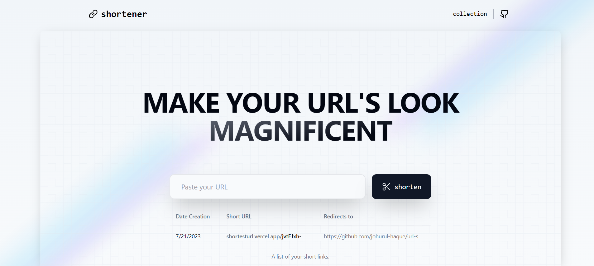

# Trim URL
An open-source link shortening website that allows users to beautify their URLs for easy sharing.



## Features
1. Shorten long URLs to easily share them with others.
2. Redirects user to the original URL when they access a shortened link.
3. Saves shortened URLs in local storage.
4. Redirect URLs can be modified after creation.
5. URLs can be removed both from server and local storage.

## Technologies Used 
* **Next.js**
* **TypeScript**
* **Tailwind CSS** 
* **Shandcn UI**
* **MongoDB**
  
## Getting Started

First, run the development server:

```bash
npm run dev
# or
yarn dev
# or
pnpm dev
```

Open [http://localhost:3000](http://localhost:3000) with your browser to see the result.


## License
This project is licensed under the MIT License.

